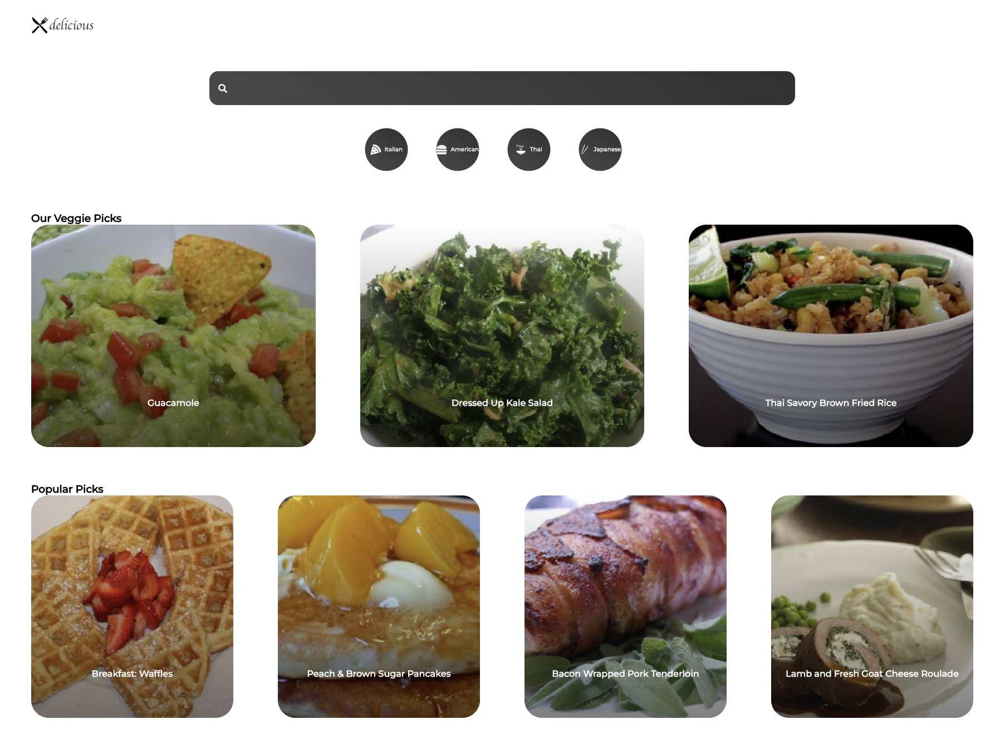

# _react-recipe-app

#### By _Joe Roaden_

#### _A REACT application utilizing Spoonacular's recipe database API.  Users can browse popular recipes and search all recipes by tags_

---
## Table of Contents
[Technologies Used](#technologies-used)  
[Description](#description)  
[Setup/Installation Requirements](#setup-and-installation-requirements)   
[Known Bugs](#known-bugs)  
[License](#License)

---
## Technologies Used

* _REACT_
* _HTML_
* _CSS_
* _JSX_
* _Spoonacular API_
* _Styled Components_

---
## Description

_Search Spoonaculars recipe database API for popular recipes or sort by most common cuisines._
---
## Setup and Installation Requirements

<strong>Initial Setup</strong>
  

1. Copy the git repository url: https://github.com/joeroaden/react-recipe-app
2. Open a shell program and navigate to your desktop.
3. Clone the repository for this project using the `git clone` command and including the copied URL.
4. While still in the shell program, navigate to the root directory of the newly created file named `react-recipe-app`.
5. From the root directory, run `npm install` to install all modules that are listed on package. json file and their dependencies
6. From the root directory, run `npm run start` to view the application on your local live server.

### Spoonacular API Documentation

1. Go to [Spoonacular API](https://spoonacular.com/food-api) and create a free account 
2. Copy API Key from 'My Console' section under 'Profile'
3. Creat a .env file at the root level of the project
4. Add your API Key as follows "REACT_APP_API_KEY=<YOUR_API_KEY>" - Note there is no spaces, carrots or underscores, just paste your API Key
5. Be sure to not commit your .env by first adding it to your .gitignore file

### Spoonacular API Docs

1. Go to [Spoonacular API Docs](https://spoonacular.com/food-api/docs) to view how to search and request info from API

2. Search Ex:

`GET https://api.spoonacular.com/recipes/complexSearch`

---
## Known Bugs

* _There are no known bugs at this time_

---
## License

[Copyright](/LICENSE) © 2022 Joe Roaden

# Getting Started with Create React App

This project was bootstrapped with [Create React App](https://github.com/facebook/create-react-app).

## Available Scripts

In the project directory, you can run:

### `npm start`

Runs the app in the development mode.\
Open [http://localhost:3000](http://localhost:3000) to view it in your browser.

The page will reload when you make changes.\
You may also see any lint errors in the console.

### `npm test`

Launches the test runner in the interactive watch mode.\
See the section about [running tests](https://facebook.github.io/create-react-app/docs/running-tests) for more information.

### `npm run build`

Builds the app for production to the `build` folder.\
It correctly bundles React in production mode and optimizes the build for the best performance.

The build is minified and the filenames include the hashes.\
Your app is ready to be deployed!

See the section about [deployment](https://facebook.github.io/create-react-app/docs/deployment) for more information.

### `npm run eject`

**Note: this is a one-way operation. Once you `eject`, you can't go back!**

If you aren't satisfied with the build tool and configuration choices, you can `eject` at any time. This command will remove the single build dependency from your project.

Instead, it will copy all the configuration files and the transitive dependencies (webpack, Babel, ESLint, etc) right into your project so you have full control over them. All of the commands except `eject` will still work, but they will point to the copied scripts so you can tweak them. At this point you're on your own.

You don't have to ever use `eject`. The curated feature set is suitable for small and middle deployments, and you shouldn't feel obligated to use this feature. However we understand that this tool wouldn't be useful if you couldn't customize it when you are ready for it.

## Learn More

You can learn more in the [Create React App documentation](https://facebook.github.io/create-react-app/docs/getting-started).

To learn React, check out the [React documentation](https://reactjs.org/).

### Code Splitting

This section has moved here: [https://facebook.github.io/create-react-app/docs/code-splitting](https://facebook.github.io/create-react-app/docs/code-splitting)

### Analyzing the Bundle Size

This section has moved here: [https://facebook.github.io/create-react-app/docs/analyzing-the-bundle-size](https://facebook.github.io/create-react-app/docs/analyzing-the-bundle-size)

### Making a Progressive Web App

This section has moved here: [https://facebook.github.io/create-react-app/docs/making-a-progressive-web-app](https://facebook.github.io/create-react-app/docs/making-a-progressive-web-app)

### Advanced Configuration

This section has moved here: [https://facebook.github.io/create-react-app/docs/advanced-configuration](https://facebook.github.io/create-react-app/docs/advanced-configuration)

### Deployment

This section has moved here: [https://facebook.github.io/create-react-app/docs/deployment](https://facebook.github.io/create-react-app/docs/deployment)

### `npm run build` fails to minify

This section has moved here: [https://facebook.github.io/create-react-app/docs/troubleshooting#npm-run-build-fails-to-minify](https://facebook.github.io/create-react-app/docs/troubleshooting#npm-run-build-fails-to-minify)

